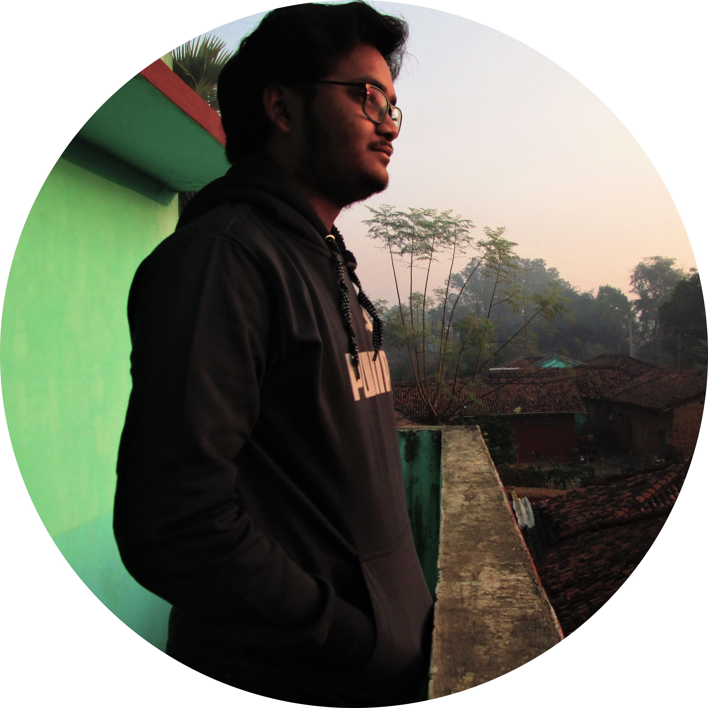

<link rel="stylesheet" href="./css/styles.css">
<link rel="stylesheet" href="./css/flaticon.css">

I'm Anshuman, a passionate geek from India👨‍💻. I'm currently a student👨‍🎓 and aspire to be a developer🚀.

 

 

        🔭 I’m currently working on a Discord server moderation bot.
     

     

                🌱 I’m currently learning Asynchronous Javascript and MongoDB.
            

            

                ❓ Ask me about anything related to C, C++, Javascript and bot creation in Discord and Telegram.
            

            

                ⚡ Fun fact: There is no place like 127.0.0.1
            

        

    

    

    

        

            Github Statistics
        

        

            
            
        

    

    

    

        

            Connect with me
        

        

            <a class="btn-dev" href="https://dev.to/anshumanmahato"><i class="flaticon-dev-badge"></i> Dev.to</a>
            <a class="btn-insta" href="https://instagram.com/anshuman_mahato"><i class="flaticon-instagram"></i> Instagram</a>
            <a class="btn-fb" href="https://www.facebook.com/anshuman.mahato.0935"><i class="flaticon-facebook"></i> Facebook</a>
        

    

